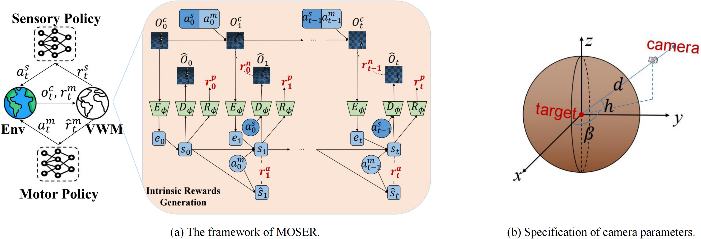

# MOSER

We propose a straightforward View-conditional Partially Observable Markov Decision Processes (VPOMDPs) assumption and develop a new method, the **MO**del-based **SE**nsor controlle**R** (**MOSER**). MOSER jointly learns a view-conditional world model (VWM) to simulate the environment, a sensory policy to control the camera, and a motor policy to complete tasks. We design intrinsic rewards from the VWM with out additional modules to guide the sensory policy to adjust the camera parameters.

  

## Code Structure

`train_moser.py`  - main function for training and evaluating moser agent

`MOSER.py`  - main function for moser agent

`utils.py`    - Logger, miscallaneous utility functions

`models.py`   - All the networks for view-conditional world model, sensory policy, and motor policy are implemented here

`replay_buffer.py` - Experience buffer for training moser

`env_wrapper.py`  - Gym wrapper for Dm_control suite and Jaco Arms

All the hyperparameters are listed in train_moser.py and are avaialble as command line args.

#### For training
`MUJOCO_GL=egl python train_moser.py --env walker-walk-changed --algo MOSERv2 --exp-name sensorstate_SAC_mi0.1_obs1e-4_rew1.0_acfreq4_tinyac_salr1e-4_sclr1e-4_splr1e-4_sun1_envdis10 --discrete 32 --kl-balancing --train --total-steps 1000000 --sensor-reward-mi-gain-coeff 0.1 --sensor-reward-obs-like-coeff 1e-4 --sensor-reward-rew-pred-coeff 1.0 --sensor-action-frequency 4 --sensor-actor-lr 1e-4 --sensor-critic-lr 1e-4 --sensor-alpha-lr 1e-4 --sensor-policy-update-num 1 --sensor-batch-size 500 --gpu 0 --seed 1`

